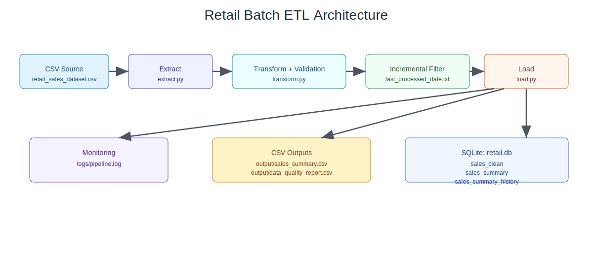

# Retail Sales Batch ETL Project

This project is a beginner-friendly but real-world style batch ETL pipeline.

## Project Goal
Process retail sales data automatically, store clean records in SQLite, and generate summary insights.

## Folder Structure

```text
retail-etl-project/
├── main.py
├── extract.py
├── transform.py
├── load.py
├── query_results.py
├── requirements.txt
├── README.md
├── tests/
│   └── test_transform.py
├── docs/
│   └── retail_etl_architecture.svg
├── data/
│   └── retail_sales_dataset.csv
├── output/
│   └── sales_summary.csv
│   └── data_quality_report.csv
├── logs/
│   └── pipeline.log
└── state/
    └── last_processed_date.txt
```

## Architecture Diagram



## Setup and Run

1. Create and activate virtual environment:

```bash
python -m venv .venv
```

Windows:

```bash
.venv\Scripts\activate
```

Linux/Mac:

```bash
source .venv/bin/activate
```

2. Install dependencies:

```bash
pip install -r requirements.txt
```

3. Put input file in `data/`:
- `data/retail_sales_dataset.csv`

4. Run pipeline:

```bash
python main.py
```

5. Run unit tests:

```bash
python -m unittest discover -s tests
```

## What the Pipeline Does

1. Extracts data from CSV.
2. Cleans data:
   - removes nulls
   - removes duplicates
   - fixes types
3. Transforms data:
   - converts `Date` to datetime
   - recalculates `Total Amount = Quantity * Price per Unit`
   - adds `Age Group`
4. Incremental load:
   - processes only records with `Date` greater than last processed date.
5. Stores outputs:
   - `sales_clean` table in `retail.db`
   - `sales_summary` table in `retail.db`
   - `sales_summary_history` table in `retail.db` (append per run for trend audits)
   - `output/sales_summary.csv`
   - `output/data_quality_report.csv`
6. Logs start/success/errors in `logs/pipeline.log`.

## Data Quality Report

`output/data_quality_report.csv` is appended on each run with:
- total input rows
- duplicate rows dropped
- rows dropped due to null values
- rows dropped due to type conversion failures
- rows dropped by business-rule checks
- final clean row count
- run timestamp

## Scheduling

### Cron (Linux/Mac)
Open crontab:

```bash
crontab -e
```

Example (daily 8:00 AM):

```cron
0 8 * * * /usr/bin/python3 /path/to/project/main.py
```

### Task Scheduler (Windows)
1. Open Task Scheduler -> Create Basic Task.
2. Name: `Retail ETL Daily`.
3. Trigger: Daily.
4. Action: Start a Program.
   - Program: path to `python.exe`
   - Arguments: `main.py`
   - Start in: your project folder
5. Finish and test run.

## Power BI Dashboard Guide

Connect Power BI to:
- `output/sales_summary.csv`, or
- `retail.db` (tables `sales_clean`, `sales_summary`).

Suggested visuals:
1. Revenue over time (line chart).
2. Sales by category (bar chart).
3. Customer demographics by age/gender (pie or stacked bar).

## Short Viva Explanation

- This is a batch ETL system: data is processed run-by-run, not stream-by-stream.
- The project is modular (`extract`, `transform`, `load`, `main`) for maintainability.
- Incremental logic is implemented with a checkpoint file (`state/last_processed_date.txt`).
- Data validation ensures type correctness and recomputed totals for consistency.
